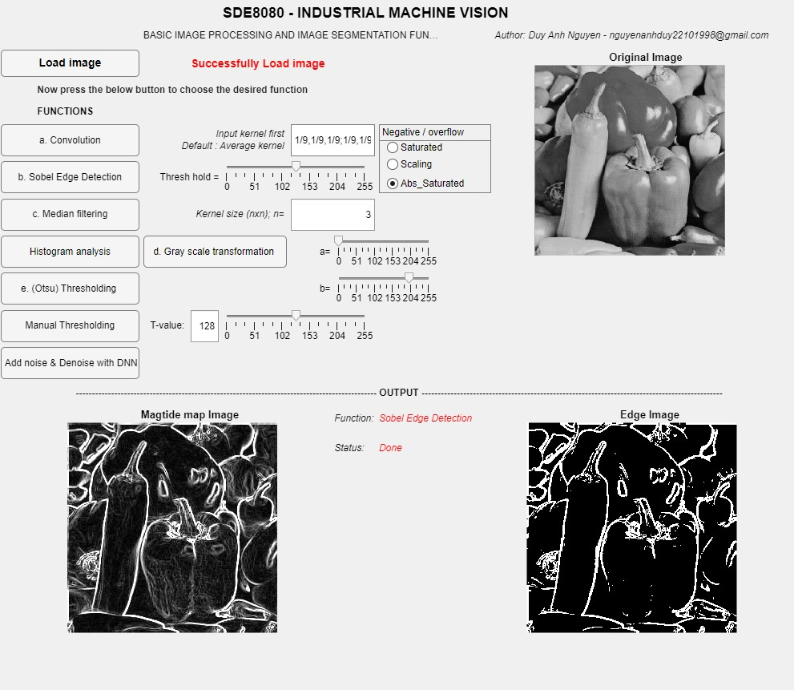

# Image Processing and Segmentation Application
This is a software application developed using Matlab and Matlab Guide that implements several basic image processing and segmentation functions on gray scale images. This application allows the user to open images, apply image processing functions, and display the processed images.

## Features
Open and display images from a file selector or file list

Select from a list of basic image processing functions:
* a. Convolution function with an arbitrary 3 by 3 kernel specified by the user. The application provides the user with several options for accommodating negative numbers and overflow including: 1) Satuarated Handling:  if the result of an operation falls outside the valid range (0-255 for 8-bit images), the value is set to the minimum or maximum valid value. 2) Scaled Handling: scaling the output values to fit within the valid range. 3) Saturated of Absolute Handling: negative values are simply set to their absolute values before using the saturated handling.
* b. Sobel edge detection algorithm (magnitude and direction). The direction information is displayed to the user using pseudocolor.
* c. Median filtering (3 by 3).
* d. Gray scale transformation algorithm based on parameters specified by the user. The application displays an image histogram to help the user select the input and output ranges.
* e. Automatic thresholding algorithm based on the image histogram. The application automatically selects a threshold using Otsu’s method and/or Optimal Pixel Classification and then displays the resulting binary image. An option for manually thresholding the image is also included.
* f. Addnoise and filter the noise with DNN function in Matlab

## Installation
Install Matlab (R2022b version) on your computer.

Download the source code from GitHub.

Open the Matlab Guide by typing guide in the Matlab command window.

In the Matlab Guide, click on 'File' and then 'Open Existing GUI'.

Navigate to the directory where you downloaded the source code and select the file Assignment_ENGN.mlapp.

## Usage
Click on 'Run' in the Matlab Guide to run the application.
In the application, click on the 'Load Image' button to open an image.
Set the parameters for the selected function using the input boxes or slider.
Select an image processing function by clicking the equivalent button.
The processed image will be displayed in the output section.

## License

## Contact
If you have any questions or feedback, please contact the developer at email address nguyenanhduy22101998@gmail.com.
